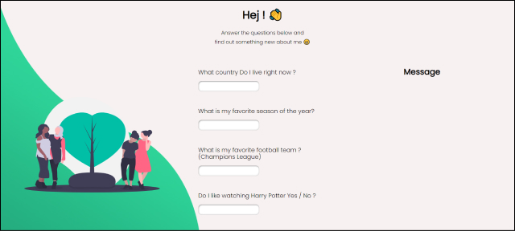

# secret-message

## Description 
This project was made independently and without any starter code. It is made with HTML, CSS and JavaScript.
Learning-By-Doing Practice.
In this project I wanted to practice Javascript.

## Preview the website live on : [DEMO](https://carolinafledgling.github.io/secret-message/)

## Screenshots

## Code Examples

event.target:  `e.target.value.toLowerCase()`  The target event property returns the element that triggered the event. The target property gets the element on which the event originally occurred. So, event.target references DOM element.

👉 More info: [event.target](https://developer.mozilla.org/en-US/docs/Web/API/Event/target)

